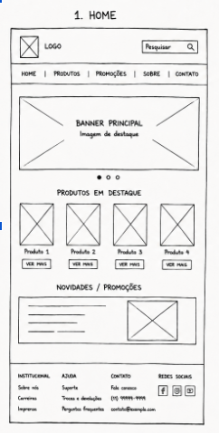
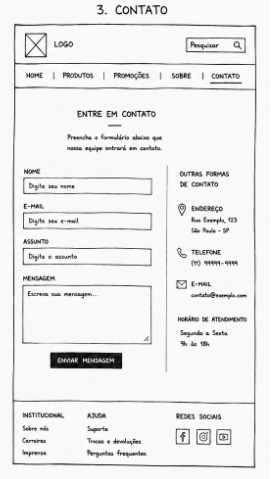

# NexGear

E-commerce de periféricos gamer (mouses, teclados, headsets e GPUs).

## Descrição do Projeto

A NexGear é uma loja virtual de periféricos gamer focada na venda de mouses, teclados, headsets e GPUs. O site funciona como uma vitrine digital onde o cliente conhece a loja pela Home, navega pelo catálogo de produtos filtrando por categoria e entra em contato pelo formulário quando precisa de atendimento ou quer tirar dúvidas.

O problema que o projeto resolve é a falta de um canal único e organizado pra apresentar periféricos gamer ao público, juntando numa mesma experiência a vitrine de destaques, o catálogo completo com filtro por categoria e o atendimento direto com a loja.

O público-alvo são gamers, streamers e entusiastas de hardware que estão montando setup, fazendo upgrade ou simplesmente buscando periféricos novos. A Home é o ponto de entrada e tem como objetivo apresentar a marca e puxar o visitante pro catálogo. A página de Produtos entrega o catálogo filtrável, com a opção de ver só Mouses, só Teclados, só Headsets ou só GPUs. A página de Contato fecha o ciclo com formulário validado, endereço e horário de funcionamento.

Mais detalhes sobre a organização das pastas, o mapa de navegação e o conteúdo de cada página estão documentados em `pages/escopo.md`.

## Estrutura Analítica do Projeto (EAP)

| Módulo | Tarefa | Responsável | Prazo | Status |
|---|---|---|---|---|
| **Módulo 1: Documentação** | Criar e manter o `README.md` do projeto | Squad | Sprint 1 | Concluído |
| **Módulo 1: Documentação** | Documentar o escopo do projeto em `pages/escopo.md` | Squad | Sprint 1 | Concluído |
| **Módulo 1: Documentação** | Elaborar a Estrutura Analítica do Projeto (EAP) | Squad | Sprint 1 | Concluído |
| **Módulo 1: Documentação** | Definir cronograma de entregas e marcos | Squad | Sprint 1 | Pendente |
| **Módulo 2: Front-End** | Desenvolver a Home (`index.html`) com banner, vitrine de produtos em promoção, menu e rodapé | Squad | Sprint 2 | Pendente |
| **Módulo 2: Front-End** | Desenvolver a página de Produtos (`pages/produtos.html`) com filtro por categoria e grid de cards | Squad | Sprint 2 | Pendente |
| **Módulo 2: Front-End** | Desenvolver a página de Contato (`pages/contato.html`) com formulário validado, endereço e horário | Squad | Sprint 3 | Pendente |
| **Módulo 2: Front-End** | Estilizar todas as páginas com o CSS de `assets/css/` | Squad | Sprint 2 | Pendente |
| **Módulo 2: Front-End** | Implementar os scripts de comportamento (filtro do catálogo e validação do formulário) em `js/` | Squad | Sprint 3 | Pendente |
| **Módulo 3: Estrutura de Pastas e Assets** | Organizar a estrutura final de pastas do projeto | Squad | Sprint 1 | Concluído |
| **Módulo 3: Estrutura de Pastas e Assets** | Disponibilizar imagens do site (banner, produtos, ícones das redes sociais) em `assets/images/` | Squad | Sprint 2 | Pendente |
| **Módulo 3: Estrutura de Pastas e Assets** | Adicionar arquivo `.gitkeep` em `assets/images/` para manter a pasta no versionamento | Squad | Sprint 1 | Concluído |

## Wireframes / Mapa de Navegação

A navegação do site é simples e funciona pelo menu, que aparece em todas as três páginas. Isso permite que o usuário vá de qualquer página pra qualquer outra sem precisar voltar pra Home antes. A Home é o ponto de entrada principal e tem link no menu tanto pra Produtos quanto pra Contato. A página de Produtos leva pela menu tanto pra Home quanto pra Contato. A página de Contato leva pela menu tanto pra Home quanto pra Produtos. Como o menu está presente nas três páginas, o usuário consegue ir de Produtos direto pra Contato, e de Contato direto pra Produtos, sem passar pela Home no meio do caminho.

Em formato de texto, o fluxo de navegação é o seguinte:

- `index.html` (Home) é a vitrine principal e ponto de entrada do site. Pelo menu, o usuário sai pra `pages/produtos.html` ou `pages/contato.html`.
- `pages/produtos.html` (Catálogo) é acessada pela Home ou direto de qualquer outra página pelo menu. Pelo menu, leva pra Home ou pra Contato.
- `pages/contato.html` (Contato) é acessada pela Home ou direto de qualquer outra página pelo menu. Pelo menu, leva pra Home ou pra Produtos.

### Home

### Produtos

### Contato

## Tecnologias e Softwares Utilizados

- **Linguagens:** HTML5, CSS3, JavaScript
- **Versionamento:** Git
- **Repositório remoto:** GitHub
- **Editor de código:** Visual Studio Code (VS Code)