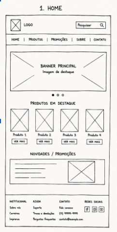
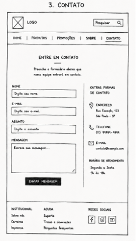

# NexGear

E-commerce de periféricos gamer.

## Descrição do Projeto

A NexGear é uma loja virtual de periféricos gamer focada na venda de mouses, teclados, headsets e GPUs. O site funciona como uma vitrine digital onde o cliente conhece a loja pela Home, navega pelo catálogo de produtos filtrando por categoria e entra em contato pelo formulário quando precisa de atendimento ou quer tirar dúvidas, com um publico alvo de gamers.

## Estrutura Analítica do Projeto (EAP)

| Módulo | Tarefa | Responsável | Status |
|---|---|---|---|
| **Módulo 1: Documentação** | Criar e manter o `README.md` do projeto | Leonardo Moura | Feito |
| **Módulo 1: Documentação** | Documentar o escopo do projeto em `pages/escopo.md` | Leonardo Moura | Feito |
| **Módulo 1: Documentação** | Elaborar a Estrutura Analítica do Projeto ou (EAP) | Leonardo Moura | Feito |
| **Módulo 1: Documentação** | Definir cronograma de entregas e marcos | Leonardo Moura | Feito |
| **Módulo 2: Front-End** | Desenvolver a Home (`index.html`) com banner, vitrine de produtos em promoção, menu e rodapé | Leonardo Moura | Feito |
| **Módulo 2: Front-End** | Desenvolver a página de Produtos `pages/produtos.html` com filtro por categoria e grid de cards | Leonardo Moura | Feito |
| **Módulo 2: Front-End** | Desenvolver a página de Contato `pages/contato.html` com formulário validado, endereço e horário | Leonardo Moura | Feito |
| **Módulo 2: Front-End** | Estilizar todas as páginas com o CSS de `assets/css/` | Leonardo Moura | Feito |
| **Módulo 2: Front-End** | Implementar os scripts de comportamento em `js/` | Leonardo Moura | Feito |
| **Módulo 3: Estrutura de Pastas e Assets** | Organizar a estrutura final de pastas do projeto | Leonardo Moura | Feito |
| **Módulo 3: Estrutura de Pastas e Assets** | Disponibilizar imagens do site em `assets/images/` | Leonardo Moura | Feito |
| **Módulo 3: Estrutura de Pastas e Assets** | Adicionar arquivo `.gitkeep` em `assets/images/` para manter a pasta no versionamento | Leonardo Moura | Feito |

## Justificativa da Escolha do Modelo (Loja Virtual)

Entre as opções de Blog de Postagens e Loja Virtual Institucional, o eu optei pela **Loja Virtual NexGear** pela maior aderência ao público de nicho gamer/hardware, onde eu gosto bastande desse tema/nicho.

## Infraestrutura e Ferramentas

### Hardware
- Notebook/desktop com no mínimo 8GB RAM, processador dual-core ou superior, suficiente para rodar editor de código, navegador com DevTools e terminal simultaneamente.
- Conexão de internet estável para versionamento remoto (GitHub) e testes de responsividade.

### Software utilizado
Ferramenta | Finalidade |
Antigravity IDE | Editor de código |
Git | Controle de versão local |
GitHub | Repositório remoto e hospedagem da documentação |

### Hospedagem planejada
Site estático, sem backend nesta etapa, so html, css e js.
Hospedagem usada no próprio GitHub Pages.

## Responsividade

O layout da NexGear é planejado para funcionar tanto em **desktop** quanto em **dispositivos móveis**
## Wireframes / Mapa de Navegação

A navegação do site é simples e funciona pelo menu, que aparece em todas as três páginas.
Em formato de texto, o fluxo de navegação é o seguinte:

- `index.html` ou Home é a vitrine principal e ponto de entrada do site. Pelo menu, o usuário sai pra `pages/produtos.html` ou `pages/contato.html`.
- `pages/produtos.html` ou Catálogo é acessada pela Home ou direto de qualquer outra página pelo menu. Pelo menu, leva pra Home ou pra Contato.
- `pages/contato.html` ou Contato é acessada pela Home ou direto de qualquer outra página pelo menu. Pelo menu, leva pra Home ou pra Produtos.

## Equipe do Projeto

Esse projeto foi feito individualmente, então os papéis do SCRUM foram todos acumulados por mim mesmo ao longo do desenvolvimento. Na prática isso significou alternar entre três personalidades diferentes em alguns momentos eu parava pra pensar no escopo e nas prioridades do projeto, em outros eu executava a codificação e no fim eu testava a entrega. O que eu mais me preocupava era de ficar muito puxado e deixar de enviar algumas entregas por atraso.

## Cronograma (Kanban)

Após a tabela EAP, fui organizar o cronograma das entregas em formato Kanban pra visualizar melhor o que já foi feito e o que ainda falta.

## Componentes das Páginas

Antes de partir pra codificação, mapeei os blocos estruturais que cada página vai ter, pensando já na semântica HTML (header, main, footer):

- **Header:** presente nas três páginas, sendo responsável pelo logo, barra de busca e menu de navegação.
- **Main:** muda de acordo com a página, na Home é o banner e vitrine de produtos em destaque;
- **Footer:** presente nas três páginas, sendo responsável por links institucionais, ajuda, formas de contato e ícones de redes sociais.

### Home

### Produtos

### Contato

Markdown
# Projeto Nova-Web - UI/UX Design ## Aula 09: UX de Tabelas de Dados e Telas de Perfil ### 1. Pesquisa Teórica - UX para Tabelas Corporativas - **Alinhamento de Dados:**    - Textos devem ser alinhados à *esquerda*.   - Números e valores monetários devem ser alinhados à *direita*.   - Status e ações rápidas podem ser centralizados. - **Filtros e Busca:**   - O campo de pesquisa principal deve ficar posicionado no topo superior esquerdo ou direito acima da tabela para rápido acesso visual.   - Filtros avançados devem ser agrupados ou dispostos em menus suspensos (dropdowns) para economizar espaço de tela. - **Hierarquia Visual:**   - Utilização de cabeçalhos fixos (*sticky header*) para tabelas extensas.   - Alternância de cores em linhas (zebra striping) ou bordas sutis para facilitar a leitura horizontal. ### 2. Especificação do Protótipo (Figma) - **Link do Projeto no Figma:** [https://www.figma.com/design/Zw5Z0mVm4TvziWUs4a1SVl/Sem-t%C3%ADtulo?node-id=0-1&t=SDMnuBlAfU1aZi4j-1] - **Telas Desenvolvidas:**   1. *Perfil de Usuário:* Exibição de avatar, dados pessoais, formulário de edição e nível de permissão.   2. *Área de Consulta (Tabela):* Lista de usuários com busca, ordenação, paginação e ações (Editar/Excluir).

## Tecnologias e Softwares Utilizados

- **Linguagens:** HTML5, CSS3, JavaScript
- **Versionamento:** Git
- **Repositório remoto:** GitHub
- **Editor de código:** Antigravity IDE